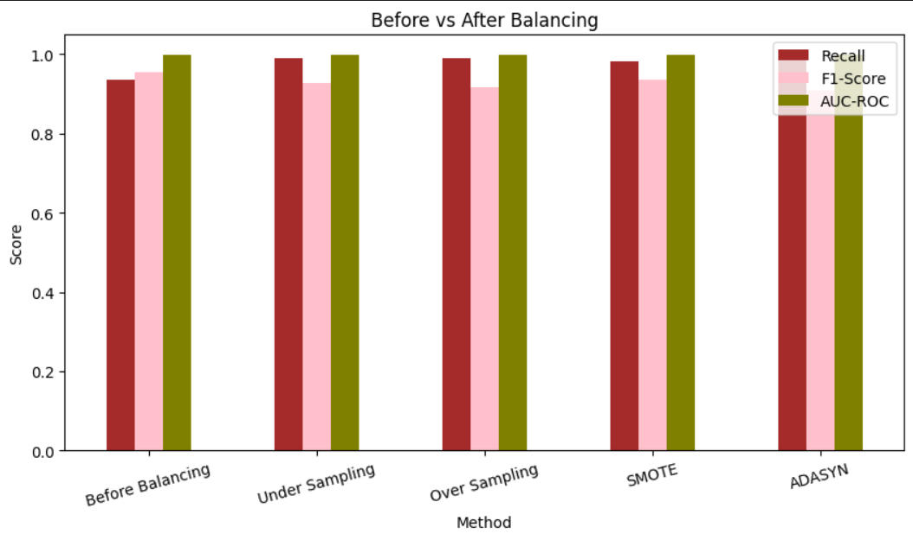
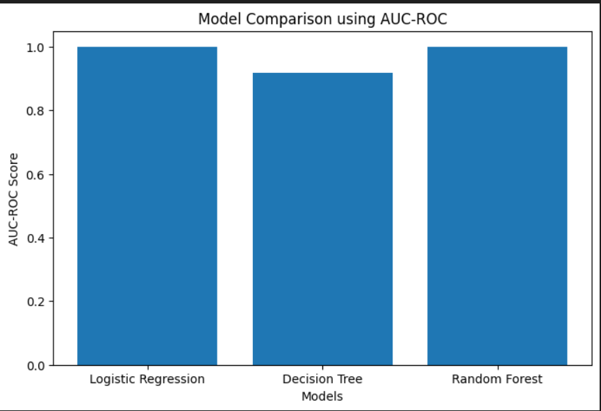
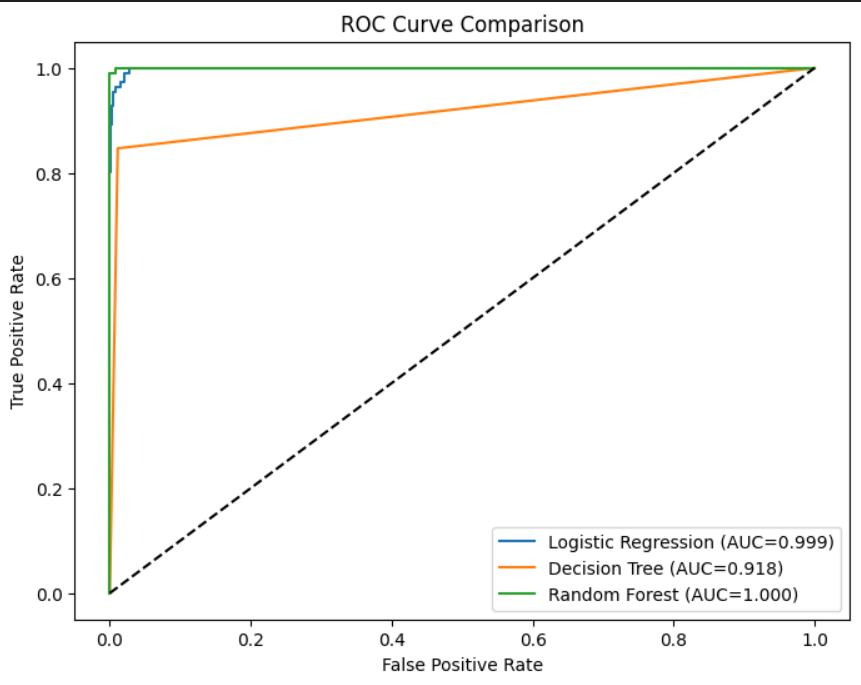

<div align="center">

# 🚨 Risk Alert Classifier

### *Intelligent Risk Detection Using Machine Learning*


> **Predict high-risk customers with precision** — leveraging ensemble learning, advanced class-balancing techniques, and robust evaluation to minimize costly false negatives in financial risk detection.

---

[📊 View Results](#-results--performance) · [⚙️ Installation](#️-installation) · [🚀 Usage](#-usage) · [📁 Dataset](#-dataset)

</div>

---

## 🌐 Live Web Application

🚀 Try the deployed Streamlit application:

👉 **https://supervised-learning---risk-alert-classifer.streamlit.app/**

### Features
- Predict customer risk levels instantly
- Interactive dashboard
- Model performance visualization
- Risk analysis and insights
- User-friendly interface

---

## 📌 Table of Contents

- [Overview](#-overview)
- [Dataset](#-dataset)
- [Project Pipeline](#-project-pipeline)
- [Balancing Methods](#-handling-class-imbalance)
- [Model Comparison](#-model-comparison)
- [Results & Performance](#-results--performance)
- [Installation](#️-installation)
- [Usage](#-usage)
- [Project Structure](#-project-structure)
- [Key Concepts](#-key-concepts)

---

## 🧠 Overview

The **Risk Alert Classifier** is a binary classification system designed to identify **high-risk customers** from financial and behavioral data. With real-world datasets suffering from severe class imbalance — where risky customers are rare but critically important — this project explores and compares multiple strategies to maximize recall and minimize Type-II errors (missed high-risk cases).

| Metric | Value |
|---|---|
| 📦 Dataset Size | 4,600 records |
| 🔢 Features | 18 input features |
| 🎯 Target | `risk_status` (Binary) |
| 🏆 Best Model | Random Forest |
| 📈 Best AUC-ROC | **1.000** |

---

## 📁 Dataset

The dataset contains **4,600 customer records** with 18 features spanning demographics, financial behavior, and transaction history.

| Feature | Description |
|---|---|
| `customer_id` | Unique customer identifier |
| `age` | Customer age |
| `gender` | Customer gender |
| `region` | Geographic region |
| `employment_type` | Employment category |
| `annual_income_inr` | Annual income (INR) |
| `credit_score` | Credit bureau score |
| `credit_utilization_ratio` | Credit utilization (%) |
| `missed_payments_12m` | Missed payments in last 12 months |
| `avg_late_payment_days` | Average days late on payments |
| `monthly_transaction_count` | Number of monthly transactions |
| `monthly_spend_inr` | Monthly spending (INR) |
| `cash_advance_count_6m` | Cash advances in last 6 months |
| `complaints_last_6m` | Complaints raised (last 6 months) |
| `failed_login_attempts_3m` | Failed logins (last 3 months) |
| `account_tenure_months` | Account age in months |
| `last_transaction_date` | Date of last transaction |
| `debt_balance_inr` | Outstanding debt balance (INR) |
| **`risk_status`** ✅ | **Target: High-risk (1) / Low-risk (0)** |

> **Missing values** were handled using **KNN Imputation** for numerical features and **Mode Imputation** for categorical features.

---

## 🔁 Project Pipeline

```
Raw Dataset (4600 rows)
        │
        ▼
📊 Exploratory Data Analysis
        │
        ▼
🧹 Data Preprocessing
   ├── KNN Imputation (numerical)
   ├── Mode Imputation (categorical)
   └── Label Encoding
        │
        ▼
✂️  Train-Test Split (80/20, stratified)
        │
        ▼
⚖️  Class Balancing (4 strategies compared)
        │
        ▼
🤖 Model Training
   ├── Logistic Regression
   ├── Decision Tree
   └── Random Forest
        │
        ▼
📈 Evaluation
   ├── Confusion Matrix
   ├── Classification Report
   ├── AUC-ROC Score
   └── ROC Curve
```

---

## ⚖️ Handling Class Imbalance

Class imbalance causes models to bias toward the majority class, resulting in poor detection of high-risk customers. Four resampling strategies were evaluated:

| Method | Strategy | Description |
|---|---|---|
| **Under Sampling** | 🔽 Reduce majority | Randomly removes majority-class samples |
| **Over Sampling** | 🔼 Increase minority | Randomly duplicates minority-class samples |
| **SMOTE** | 🧬 Synthetic | Generates synthetic minority samples via interpolation |
| **ADASYN** | 🎯 Adaptive | Focuses synthesis on harder-to-classify boundary samples |

### 📊 Balancing Method Comparison



> **Key Insight:** All balancing methods maintained high Recall (≥0.85) and AUC-ROC (~1.00), with **SMOTE** and **Over Sampling** delivering the best F1-Score balance.

---

## 🤖 Model Comparison

Three classifiers were trained and evaluated after applying the optimal balancing strategy:

| Model | AUC-ROC | Notes |
|---|---|---|
| 🔵 Logistic Regression | **0.999** | Excellent linear baseline |
| 🟠 Decision Tree | **0.918** | Prone to overfitting without tuning |
| 🟢 Random Forest | **1.000** | Best overall performance |

### 📊 AUC-ROC Model Comparison



---

## 📈 Results & Performance

### ROC Curve Comparison



The **ROC Curve** illustrates each model's ability to distinguish high-risk from low-risk customers across all classification thresholds:

- 🟢 **Random Forest** (AUC = 1.000) — Perfect discrimination; ideal for production deployment
- 🔵 **Logistic Regression** (AUC = 0.999) — Near-perfect; lightweight and interpretable
- 🟠 **Decision Tree** (AUC = 0.918) — Competitive but falls short without ensemble boosting

### 🎯 Error Analysis

> In risk classification, **Type-II Error (False Negative)** is more dangerous than Type-I — missing a high-risk customer causes financial loss, fraud exposure, or payment defaults.

| Error Type | Description | Impact |
|---|---|---|
| ⚠️ **Type-I** (False Positive) | Low-risk flagged as high-risk | Minor inconvenience |
| 🚨 **Type-II** (False Negative) | High-risk missed entirely | **Financial risk / fraud** |

---

## ⚙️ Installation

```bash
# 1. Clone the repository
git clone https://github.com/your-username/risk-alert-classifier.git
cd risk-alert-classifier

# 2. Create a virtual environment (recommended)
python -m venv venv
source venv/bin/activate  # Windows: venv\Scripts\activate

# 3. Install dependencies
pip install -r requirements.txt
```

### 📦 Requirements

```txt
pandas>=2.0
numpy>=1.24
scikit-learn>=1.3
imbalanced-learn>=0.11
matplotlib>=3.7
seaborn>=0.12
jupyter>=1.0
```

---

## 🚀 Usage

```bash
# Launch Jupyter Notebook
jupyter notebook Risk_Alert_Classifier.ipynb
```

Or run the pipeline directly in Python:

```python
import pandas as pd
from sklearn.ensemble import RandomForestClassifier
from sklearn.model_selection import train_test_split
from imblearn.over_sampling import SMOTE

# Load data
df = pd.read_csv("Risk_Alert_Classifier_Dataset_4600.csv")

# Preprocess and split
X = df.drop("risk_status", axis=1)
y = df["risk_status"]
X_train, X_test, y_train, y_test = train_test_split(X, y, test_size=0.2, stratify=y, random_state=42)

# Balance classes
sm = SMOTE(random_state=42)
X_res, y_res = sm.fit_resample(X_train, y_train)

# Train best model
model = RandomForestClassifier(random_state=42)
model.fit(X_res, y_res)

# Predict
y_pred = model.predict(X_test)
```

---

## 📂 Project Structure

```
risk-alert-classifier/
│
├── 📓 Risk_Alert_Classifier.ipynb        # Main notebook (full pipeline)
├── 📊 Risk_Alert_Classifier_Dataset_4600.csv  # Dataset
│
├── 📁 images/
│   ├── balancing_method.png              # Before vs After Balancing chart
│   ├── model_comparison.png              # AUC-ROC model comparison
│   └── ROC_curve.png                     # ROC Curve comparison
│
├── 📄 requirements.txt                   # Python dependencies
└── 📖 README.md                          # Project documentation
```

---

## 📚 Key Concepts

<details>
<summary><b>🔍 What is AUC-ROC?</b></summary>

AUC-ROC measures a classifier's ability to distinguish between classes across all thresholds. The ROC curve plots **True Positive Rate (Recall)** vs **False Positive Rate**. An AUC of **1.0** indicates perfect classification; **0.5** is random guessing.

</details>

<details>
<summary><b>⚖️ Why does class imbalance matter?</b></summary>

When one class dominates (e.g., 90% low-risk), a model can achieve 90% accuracy by always predicting "low-risk" — yet completely fail to detect any high-risk case. Resampling corrects this bias.

</details>

<details>
<summary><b>🧬 How does SMOTE work?</b></summary>

SMOTE (Synthetic Minority Over-sampling Technique) creates **synthetic samples** by interpolating between existing minority-class observations rather than simply duplicating them — leading to more generalizable decision boundaries.

</details>

<details>
<summary><b>🌲 Why Random Forest outperforms others?</b></summary>

Random Forest is an ensemble of decision trees trained on random subsets of data and features. This reduces overfitting, handles non-linear patterns, and is naturally robust to class imbalance — explaining its AUC of 1.000.

</details>

---

<div align="center">

### ⭐ If this project helped you, give it a star!

Made with ❤️ using Python & Scikit-Learn

</div>
